<div align="center">



<br />

<a href="https://github.com/ProCodesWithPratap?tab=followers">
  
</a>
<a href="https://github.com/ProCodesWithPratap?tab=repositories">
  
</a>
<a href="https://www.instagram.com/veerpratap_officials">
  
</a>


<br />
<br />



</div>

---

## ⚡ Developer Signal

### I am **Veer Pratap** — `ProCodesWithPratap`

I am a **vibe coder** and **UI-focused full-stack developer in progress**, building clean interfaces, practical tools, and product-style web experiences.

My goal is not to collect random repositories. My goal is to turn every project into visible proof of **taste, execution, consistency, and growth**.

```ts
const veer = {
  handle: "ProCodesWithPratap",
  identity: "Vibe Coder",
  focus: "UI-focused full-stack development",
  stack: ["React", "Vite", "Tailwind", "Node", "PostgreSQL"],
  learning: ["TypeScript", "Python", "C++", "C#"],
  principle: "Useful first. Beautiful always."
};
```

- 🧠 **UI thinking:** clean layout, strong hierarchy, smooth user flow
- ⚙️ **Engineering thinking:** readable code, real logic, database-aware structure
- 🚀 **Shipping thinking:** build fast, test honestly, polish continuously
- 🎯 **Learning direction:** frontend depth, backend confidence, stronger product sense

---

## 🧭 Current Operating System

```txt
Idea → Product Flow → Interface → Logic → Data → Test → Deploy → Polish
```

| Layer | What I focus on |
|---|---|
| **Design** | Responsive layouts, clean spacing, readable hierarchy, dark-mode polish |
| **Frontend** | React components, Vite speed, Tailwind systems, reusable UI patterns |
| **Backend** | APIs, authentication flow, Prisma models, PostgreSQL structure |
| **Shipping** | GitHub workflow, deployment readiness, README clarity, iteration |
| **Growth** | Better logic, cleaner architecture, stronger public project quality |

---

## 🧰 Tech Arsenal

<div align="center">

### Languages


### Frontend


### Backend, Database & APIs


### Tools & Deployment


</div>

---

## 🚀 Featured Public Build

<div align="center">

<a href="https://github.com/ProCodesWithPratap/dev-profile-studio">
  
</a>

</div>

### `dev-profile-studio`

A modern **React + Vite + Tailwind CSS** app that generates polished GitHub profile README files.

**Why this project matters:** a developer profile is not just decoration. It is a public proof-of-work surface. This project helps developers turn scattered skills into a cleaner, sharper, more credible profile.

**Core features:**

- Live GitHub profile README markdown generation
- Editable profile fields for identity, headline, skills, tools, links, and goals
- Built-in templates for focused, student, and professional profiles
- Optional stats, streak, language, and visitor badge sections
- Copy-to-clipboard and download-as-`README.md` workflow
- Clean responsive UI built with Tailwind CSS

---

## 🧩 Builder Zones

| 🎨 Interface Craft | ⚙️ App Logic | 🧠 Developer Tools |
|---|---|---|
| Landing pages | API flows | README generators |
| Dashboards | Form handling | Workflow utilities |
| Profile systems | Auth patterns | Markdown systems |
| Dark/cozy themes | Database models | Profile builders |
| Responsive components | Error-state thinking | Productivity interfaces |

---

## 📊 GitHub Command Center

<div align="center">


<br />
<br />


<br />
<br />


<br />
<br />


</div>

---

## 🛡️ Build Standards I Am Growing Into

```txt
Readable code > clever code
Useful UI > flashy UI
Secure defaults > risky shortcuts
Small shipped product > endless unfinished idea
Consistent commits > random bursts of motivation
```

- Validate inputs before trusting data
- Keep components focused and reusable
- Name files and functions so future-me understands them
- Make loading, empty, and error states part of the design
- Write READMEs that explain purpose, stack, setup, and usage clearly

---

## 🎯 2026 Direction

- Ship more polished public projects
- Build portfolio-quality React applications
- Improve DSA and programming logic consistently
- Learn deeper backend architecture and database design
- Turn `dev-profile-studio` into a stronger developer-branding tool
- Make this profile show growth through real commits, not just visuals

---

## 🌐 Connect With Me

<div align="center">

<a href="https://github.com/ProCodesWithPratap">
  
</a>
<a href="https://www.instagram.com/veerpratap_officials">
  
</a>

</div>

---

<div align="center">

### `Building with taste. Shipping with discipline. Improving with every commit.`

</div>
